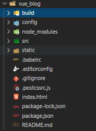

## Vue项目结构解析

### 项目机构图

#### src文件夹[重点文件]
* assets——静态资源，如css，js
* components——公共组件
* router——路由文件
* App.vue——根组件
* main.js——入口文件

#### index.html
> ndex.html如其他html一样，但一般只定义一个空的根节点，在main.js里面定义的实例将挂载在根节点下，内容都通过vue组件来填充。

#### App.vue
> 一个vue页面通常由三部分组成:模板(template)、js(script)、样式(style)
* template
    > 其中模板只能包含一个父节点，<router-view/>为<router-view></router-view>的简写，是子路由视图，后面的路由页面都显示在此处。
* script
    > vue通常用es6来写，用export default导出，其下面可以包含数据data，生命周期(mounted等)，方法(methods)等。
* style
    > 样式通过style标签包裹，默认是影响全局的，如需定义作用域只在该组件下起作用，需在标签上加scoped， 
 
#### main.js
> main.js主要是引入vue框架，根组件及路由设置，并且定义vue实例

#### router
> router下的index.js文件中的routes定义了路径为'/'的路由

#### package.json
> 需要下载的模块，vue，插件...都在这下面