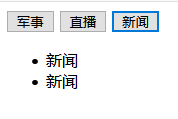
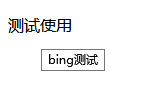

## Vue常用命令

#### 概述
> Vue框架给我们提供了很多指令，都是以v-xxx开头（为什么是以V开头，因为是由Vue提供的），Vue提供这些指令其实都是作为标签属性直接使用

#### Vue中的模版语法
> Vue.js 使用了基于 HTML 的模板语法，允许开发者声明式地将 DOM 绑定至底层 Vue 实例的数据。所有 Vue.js 的模板都是合法的 HTML，所以能被遵循规范的浏览器和 HTML 解析器解析

#### 指令
> 指令是由Vue提供的，主要的作用是可以操作标签（文本、样式、事件等等）

#### Vue命令
* v-text
    > 数据绑定最常见的形式就是使用“Mustache”语法 (双大括号) 的文本插值；可以更新标签文本内容
    * 范例：设置标题
        ```html
        <!DOCTYPE html>
        <html lang="en">
        <head>
            <meta charset="UTF-8">
            <meta name="viewport" content="width=device-width, initial-scale=1.0">
            <meta http-equiv="X-UA-Compatible" content="ie=edge">
            <title>Document</title>
            <!-- 引包 -->
            <script src="./js/vue.min.js"></script>
        </head>
        <body>
            <div id="app">
                <!-- 方式一 -->
                <h2>
                    {{msg}}
                </h2>
                <!-- 方式二 -->
                <h2 v-text="msg"></h2>
            </div>
        </body>
        </html>
  
        <script>
            //创建Vue实例
            var vm = new Vue({
                el: "#app",
                data: {
                    msg: "孤岛Vue"
                }
            })
        </script>
        ```
* v-html
    > 可以更新标签文本内筒【如果渲染数据为标签形式字符串，会真的渲染为标签】
    * 范例：
        ```html
        <body>
            <div id="app">
                <p v-html="msg"></p>
            </div>
        </body>
        </html>
        
        <script>
            //创建Vue实例
            var vm = new Vue({
                el: "#app",
                data: {
                    msg: "孤岛Vue"
                }
            })
        </script>
        ```
* v-on
    > 可以给元素绑定事件。V-on简写方式即为@
    * 范例：
        ```html
        <body>
            <div id="app">
                <!-- 鼠标移入事件绑定 -->
                <p @mouseenter="mouse">鼠标移动</p>
                <!-- 鼠标点击事件 -->
                <button @click="click">点击事件</button>
            </div>
        </body>
        </html>
        <script>
            var vm = new Vue({
                el: '#app',
                <!-- 事件处理函数地方 -->
                methods: {
                    mouse(){
                        alert("鼠标移动上来了")
                    },
                    click(){
                        alert("点击了一次")
                    }
                }
            })
        </script>
        ```    
* v-show
    > v-show指令可以控制标签的显示与隐藏，底层原理其实是通过CSS中display属性进行控制
    * 范例
        ```html
        <body>
            <div id="app">
                <button @click="add('军事')">军事</button>
                <button @click="add('直播')">直播</button>
                <button @click="add('新闻')">新闻</button>
                <ul v-show="'军事'==info">
                    <li>军事</li>
                    <li>军事</li>
                </ul>
                <ul v-show="'直播'==info">
                    <li>直播</li>
                    <li>直播</li>
                </ul>
                <ul v-show="'新闻'==info">
                    <li>新闻</li>
                    <li>新闻</li>
                </ul>
            </div>
        </body>
        </html>
        <script>
            var vm = new Vue({
                el: '#app',
                data: {
                    info: ''
                },
                methods: {
                    add(data){
                        this.info = data
                    }
                }
            })
        </script>
        ```
        
* v-if
    > v-if根据属性值为真假进行渲染标签
    * v-if和v-show区别
        * v-show：当隐藏结构时是在该结构的style中加上display:none，结构依然保留
        * v-if：控制标签在节点树上上树、下树操作，当隐藏结构时该结构会直接从整个dom树中移除
    * 案例：
    ```html
    <body>
        <div id="app">
            <p>你的性别是：</p>
            <li v-if="'男'==sex">男</li>
            <li v-else-if="'女'==sex">女</li>
            <li v-else="'未知'==sex">未知</li>
        </div>
    </body>
    </html>
    <script>
        var vm = new Vue({
            el: '#app',
            data: {
                sex: "男"
            }
        })
    </script>    
    ```
* v-for
    > 我们可以用  v-for 指令基于一个数组来渲染一个列表。 v-for 指令需要使用  item in items 形式的特殊语法，其中  items 是源数据数组，而  item 则是被迭代的数组元素的别名
    * 案例：
        ```html
        <body>
            <div id="app">
                <!-- 遍历arr中的所有数据 -->
                <ul>
                    <li v-for="item in arr">{{item}}</li>
                </ul>
                <br>
        
                <!-- 遍历arr中的所有数据并带编号 -->
                <ul>
                    <li v-for="(item, index) in arr">{{item}},{{index}}</li>
                </ul>
                <br>
        
                <!-- 显示1-2数字 -->
                <ul>
                    <li v-for="item in 2">{{item}}</li>
                </ul>
                <br>
        
                <!-- 9行9列都遍历为小明 -->
                <table>
                    <tr v-for="row in 9">
                        <td v-for="col in 9">小明</td>
                    </tr>
                </table>
            </div>
        </body>
        </html>
        <script>
            var vm = new Vue({
                el: '#app',
                data: {
                    arr: ['a','b','c']
                }
            })
        </script>
        ```
* v-model[数据互相绑定]
    > 只能给表单元素使用【给非表单元素使用也可以，但是没有任何效果】;指令在表单控件元素上创建双向数据绑定,所谓双向绑定，指的就是我们在js中的vue实例中的data与其渲染的dom元素上的内容保持一致，两者无论谁被改变，另一方也会相应的更新为相同的数据最基础的就是实现一个联动的效果
    * 案例：
        ```html
        <body>
            <div id="app">
                <h3>{{msg}}</h3>
                <input type="text" v-model="msg">
            </div>
        </body>
        </html>
        <script>
            var vm = new Vue({
                el: '#app',
                data: {
                    msg: ''
                }
            })
        </script>
        ```

* v-bind[属性值绑定]
    > 它可以往元素的属性中绑定数据，也可以动态地根据数据为元素绑定不同的样式
    * 案例：
        ```html
        <body>
            <div id="app">
                <p v-bind:title="test">测试使用</p>
            </div>
        </body>
        </html>
        <script>
            var vm = new Vue({
                el: '#app',
                data: {
                    test: 'bing测试'
                }
            })
        </script>
        ```
        