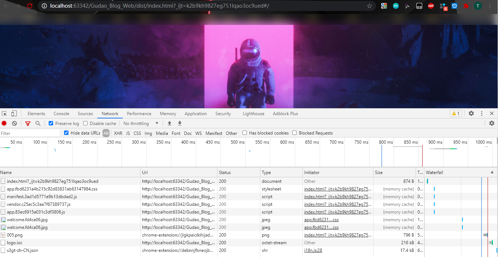

## Angular项目部署问题【亲测有效】

### 项目build之后资源文件404问题
> 自己的项目通过`ng build --prod`之后，将打包文件上传到服务器之后，访问发现自己的项目是空白的，打开控制台看了之后发现静态资源都报了404

#### 问题原因
> 自己在项目中写的路径大都是绝对路径，所以访问不到了

#### 解决
* Angular中，html中的路径要写成开头不带/的绝对路径
```js

```

* Angular中，CSS中的路径要写成相对路径，比如
```js
background: url(../../../assets/img/404.jpg) 50px;
```

* Angular项目ng build编译后的index.html中的base ref要设置为空【通过build后面 + --base-href 】
```js
<base href="">
```

* 执行打包命令
```shell
ng build --prod --output-path docs --base-href 
```

* 本地测试
    > 进入打包好后的docs文件夹，通过浏览器打开index.html界面，如果图片效果等展示都没有问题，则配置完成

  
### 项目上传后通过域名访问不到index界面

#### 安装nginx【参考：【YC】nginx安装.md】

#### 配置nginx.conf
* 将root中的路径修改为你打包项目中index.html所在的包下
```shell
worker_processes  1;

events {
    worker_connections  1024;
}


http {
    include       mime.types;
    default_type  application/octet-stream;

    sendfile        on;

    keepalive_timeout  65;

    server {
        listen       80;
        server_name  localhost;

        # 修改：将root中的路径修改为你打包项目中index.html所在的包下
        location / {
            root   /gudao/docs;
            index  index.html index.htm;
        }

        #error_page  404              /404.html;

        # redirect server error pages to the static page /50x.html
        #
        error_page   500 502 503 504  /50x.html;
        location = /50x.html {
            root   html;
        }
}
```

* 关闭nginx，通过配置文件重启nginx
```shell
# 杀进程
kill ng进程
# 进入启动文件位置
cd /安装位置/sbin
# 通过配置文件启动
./nginx -c /配置文件位置
```