## Windows安装WebLogic环境

### 安装说明
* [官网下载地址](https://www.oracle.com/middleware/technologies/weblogic-server-downloads.html)
* JDK1.8
* 此次使用版本12.2.1.4

### 官网下载
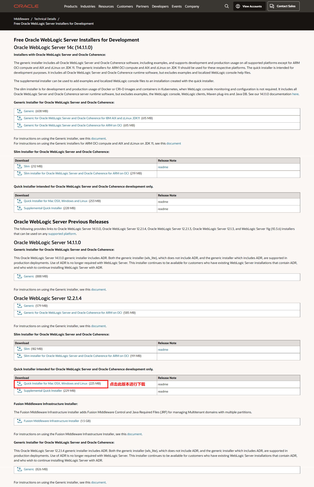

### 解压安装包
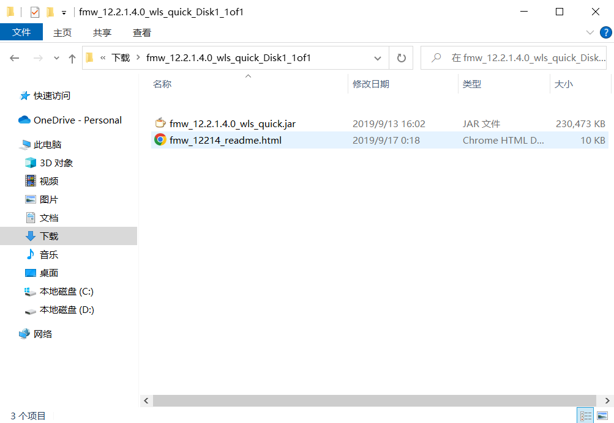

### 管理员启动dos窗口
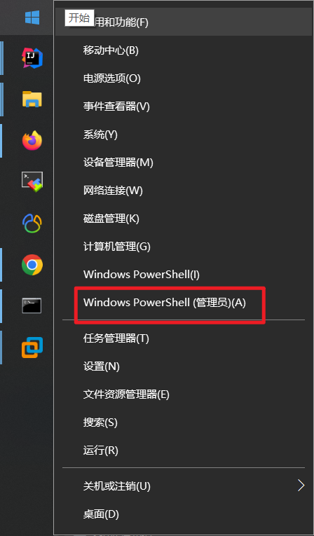

### 执行jar文件
```shell
cd 下载包解压出来的jar包位置

# java -jar 需要部署的weblogic的jar
java -jar fmw_12.2.1.4.0_wls_quick.jar

# 安装完成标识
完成百分比:70
完成百分比:80
完成百分比:90
完成百分比:100

Oracle Fusion Middleware 12c WebLogic 和 Coherence Developer 12.2.1.4.0 的 安装 已成功完成
日志已成功复制到...
```
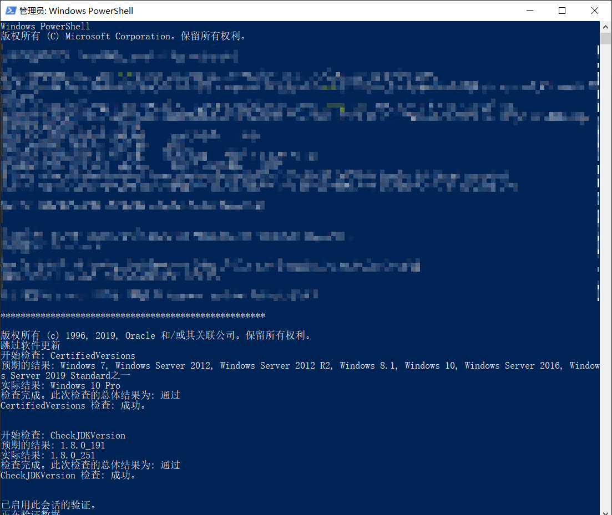

### 安装完成，启动
#### 安装完成后，会在jar包的同级目录下创建一个文件夹
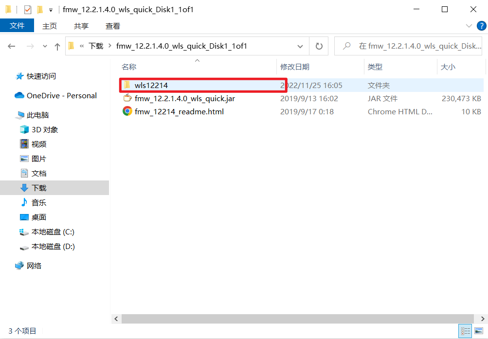
#### 配置环境变量`MW_HOME`
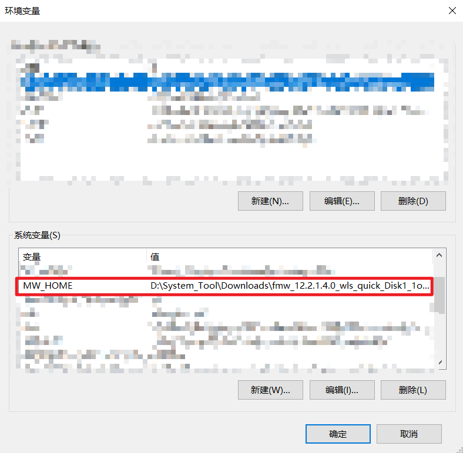

### 在生成的文件夹中（wls版本号）创建domain
> 进入`运行jar包文件夹位置\执行jar包生成的文件夹中\oracle_common\common\bin`找到config.cmd，运行此文件
* 点击后，会出现配置向导界面，一直下一步，到向导3界面，需要配置帐号密码，如图
  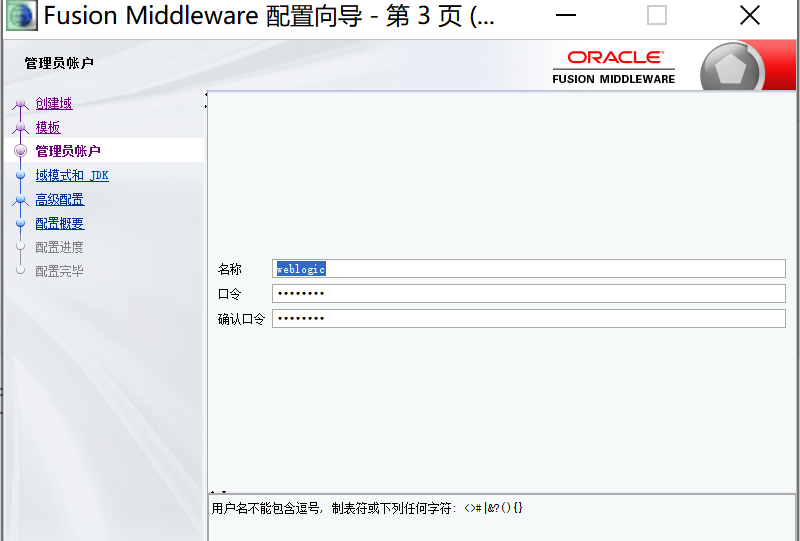

### 启动自己的配置的WebLogic
> 进入`运行jar包文件夹位置\执行jar包生成的文件夹中\user_projects\domains\base_domain`找到startWebLogic.cmd，运行此文件
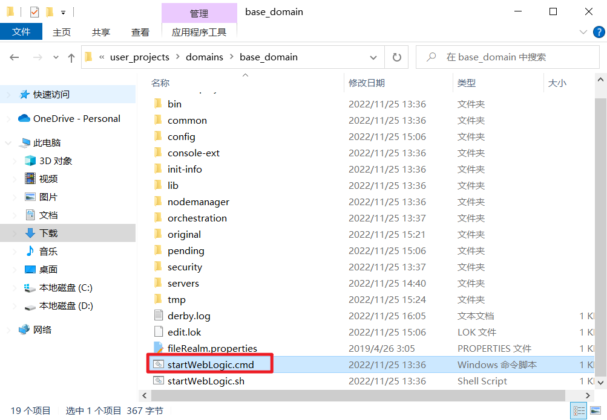
* 出现Server state changed to RUNNING 字样，说明启动成功
  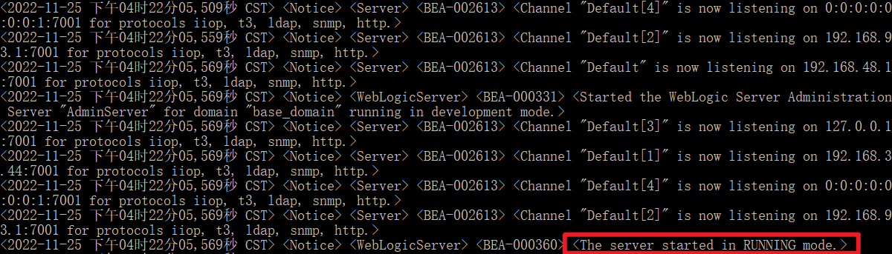

### 访问
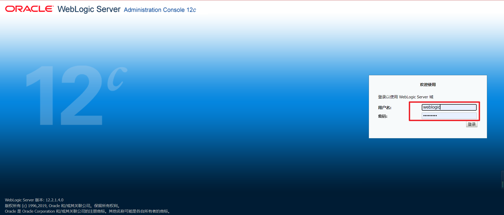

### 创建java的webapp项目
#### 点击install
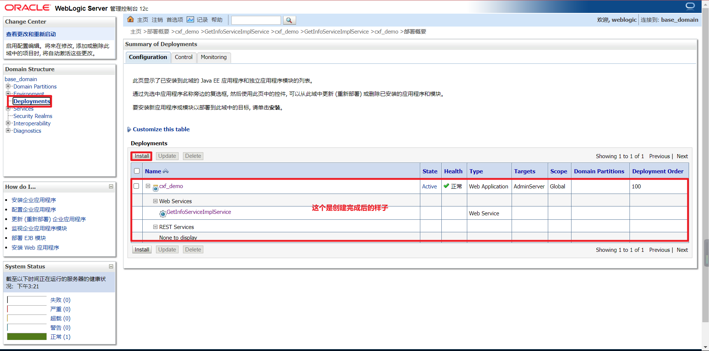
#### 选择war包位置，然后一路`下一步`
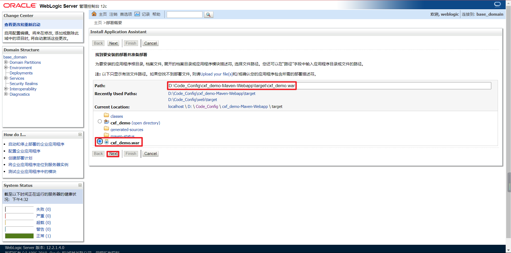
#### 访问
> 通过`http://localhost:7001/`+`上下文根`来访问
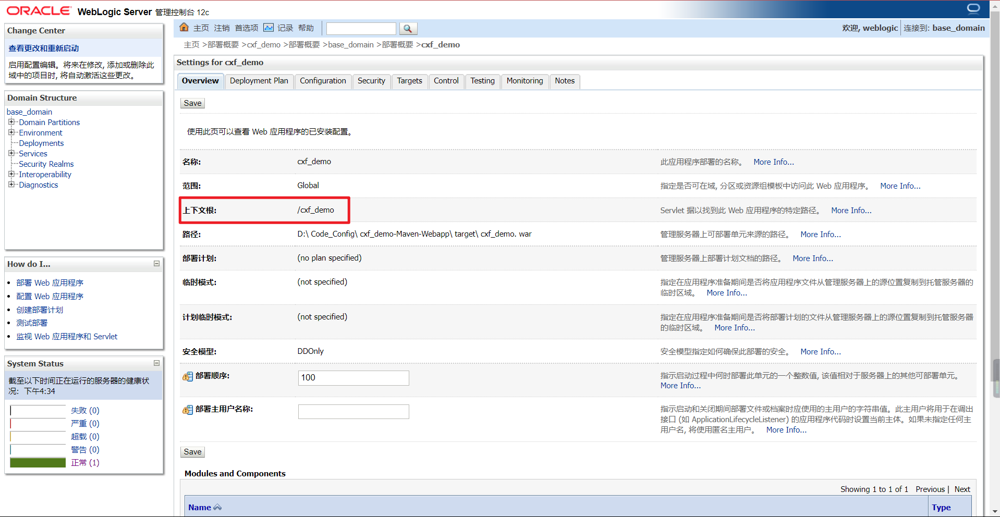


