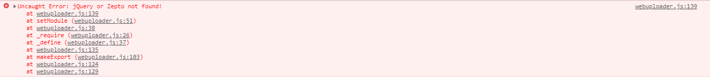
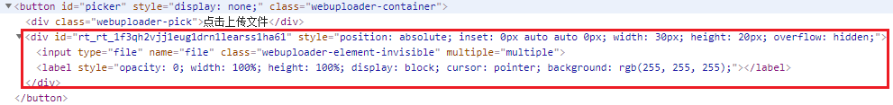

## WebUpload方法说明[文件上传]
[官网](https://fex.baidu.com/webuploader)

### 引入资源
> 使用Web Uploader文件上传需要引入三种资源：JS, CSS
```html
<!--引入CSS-->
<link rel="stylesheet" type="text/css" href="webuploader文件夹/webuploader.css">

<!--引入JS-->
<script type="text/javascript" src="webuploader文件夹/webuploader.js"></script>

<!-- 注意：一定要引用jquery，不然前端控制台会报错；如图 -->
<script type="text/javascript" src="jquery.js"></script>
```


### html部分
```html
<div id="uploader" class="wu-example">
    <!--用来存放文件信息-->
    <div id="thelist" class="uploader-list"></div>
    <div class="btns">
        <!-- webupload内部会通过picker来生成file的input标签和label标签，生成信息如图 -->
        <div id="picker">选择文件</div>
        <button id="ctlBtn" class="btn btn-default">开始上传</button>
    </div>
</div>
```


### js部分
* 初始化Web Uploader
```js
var uploader = WebUploader.create({
    auto: true,// 选完文件后，是否自动上传。
    swf: 'Uploader.swf',// swf文件路径
    server: 'http://localhost:8080/upload',// 文件接收服务端。
    dnd: '#upload-container',
    pick: '#picker',// 内部根据当前运行是创建，可能是input元素，也可能是flash. 这里是div的id
    multiple: true, // 选择多个
    chunked: true,// 开启分片上传。
    threads: 20, // 上传并发数。允许同时最大上传进程数。
    method: 'POST', // 文件上传方式，POST或者GET。
    fileSizeLimit: 1024*1024*1024*10, //验证文件总大小是否超出限制, 超出则不允许加入队列。
    fileSingleSizeLimit: 1024*1024*1024, //验证单个文件大小是否超出限制, 超出则不允许加入队列。
    fileVal:'upload' // [默认值：'file'] 设置文件上传域的name。
});
```
* 文件入对列之前初始化信息
```js
uploader.on("beforeFileQueued", function(file) {
    // 执行自己项目中的业务逻辑 
});
```
* 文件入队的一瞬间所需要初始化的内容
```js
uploader.on('fileQueued', function(file) {
        // 选中文件时要做的事情，比如在页面中显示选中的文件并添加到文件列表，获取文件的大小，文件类型等
        console.log(file.ext); // 获取文件的后缀
        console.log(file.size);// 获取文件的大小
        console.log(file.name);
        
        // 新建队列信息
        var html = '<div class="upload-item"><span>文件名：'+file.name+'</span><span data-file_id="'+file.id+'" class="btn-delete">删除</span><span data-file_id="'+file.id+'" class="btn-retry">重试</span><div class="percentage '+file.id+'" style="width: 0%;"></div></div>';
        $('#upload-list').append(html);
        // 生成文件的md5值，代表文件的唯一性
        uploader.md5File( file )//大文件秒传

        // 及时显示md5生成进度
        .progress(function(percentage) {
            console.log('Percentage:', percentage);
        })

        // md5生成完成
        .then(function(val) {
            console.log('md5 result:', val);
        });
    });
```
* 上传进度
```js
uploader.on('uploadProgress', function(file, percentage) {
    // 上传进度条显示
    console.log(percentage * 100 + '%');
    var width = $('.upload-item').width();
    $('.'+file.id).width(width*percentage);
});
```
* 上传成功/失败执行信息
```js
// 上传成功执行【单个上次成功后就会执行】
uploader.on('uploadSuccess', function(file, response) {
    // 自己的业务逻辑
    console.log(file.id+"传输成功");
});

// 上传失败执行
uploader.on('uploadError', function(file) {
    // 自己的业务逻辑
    console.log(file);
    console.log(file.id+'upload error')
});
```
* 队列中的数据操作
```js
$('#upload-list').on('click', '.upload-item .btn-delete', function() {
    // 从文件队列中删除某个文件id
    file_id = $(this).data('file_id');
    // uploader.removeFile(file_id); // 标记文件状态为已取消
    uploader.removeFile(file_id, true); // 从queue中删除
});
```
* 上传失败后重试机制
```js
$('#upload-list').on('click', '.btn-retry', function() {
    uploader.retry($(this).data('file_id'));
});
```
* 上传成功后执行【所有的文件都上传成功执行，只会出发一次】
```js
uploader.on('uploadComplete', function(file) {
    console.log(uploader.getFiles());
});
```

