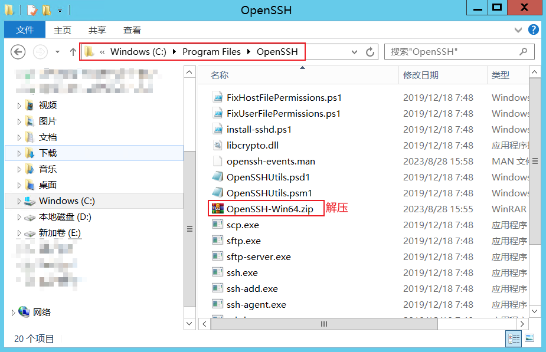
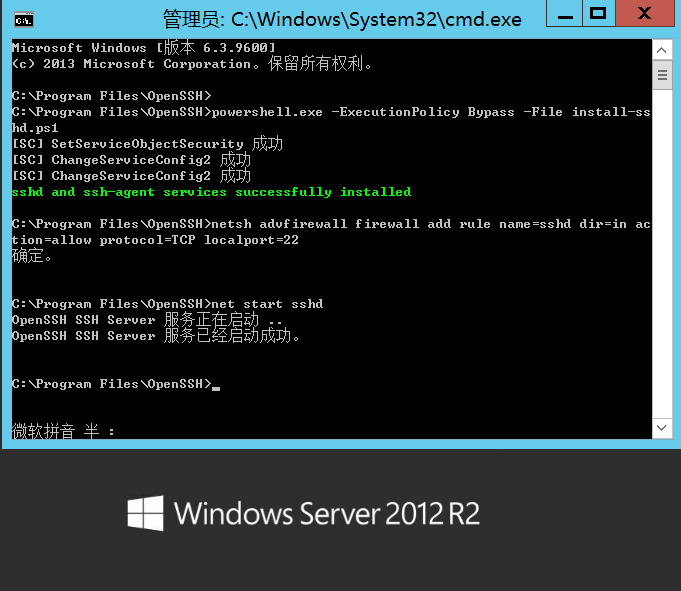

## Windows-server开启OpenSSH服务器（scp / ssh等）

### 环境
Windows-Server2012

### 下载OpenSSH安装包
[官方开源地址](https://github.com/PowerShell/Win32-OpenSSH/releases)

### 压到指定目录(C:\Program Files\OpenSSH)


### CMD管理员模式下安装
```shell
# 进入解压OpenSSH位置
cd C:\Program Files\OpenSSH

# 安装sshd服务
powershell.exe -ExecutionPolicy Bypass -File install-sshd.ps1

# 开放22号端口
netsh advfirewall firewall add rule name=sshd dir=in action=allow protocol=TCP localport=22

# 启动OpenSSH服务
net start sshd
```


### 配置OpenSSH系统环境变量(PATH)，设置开机自启
```shell
# 在系统环境变量PAHT中添加
;C:\Program Files\OpenSSH

# 配置开机自启sshd服务
sc config sshd start= auto
```

### 远程连接测试
```shell
# 命令
ssh 用户名@用户ip

# 演示
ssh username@127.0.0.1
```
