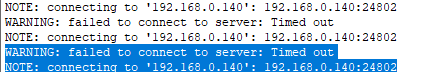
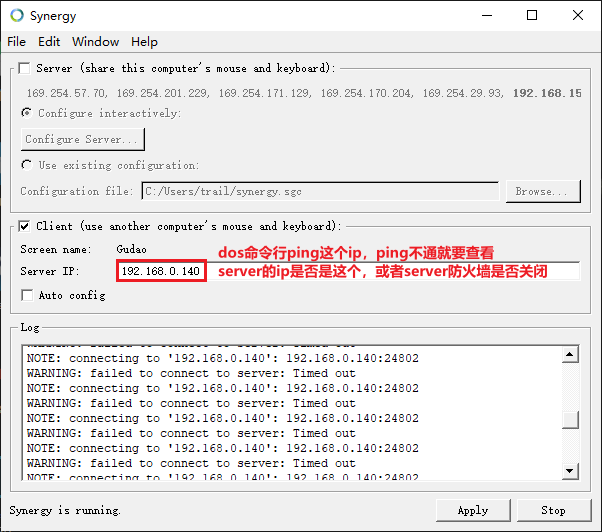
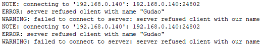
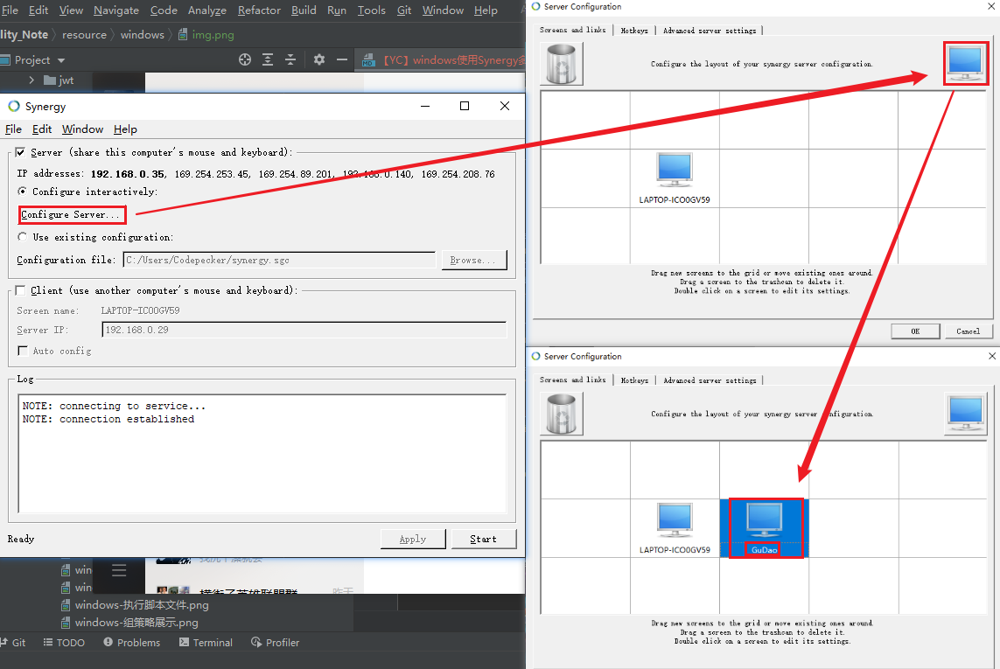
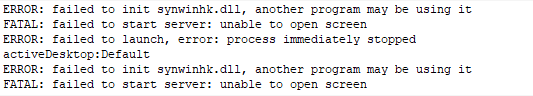
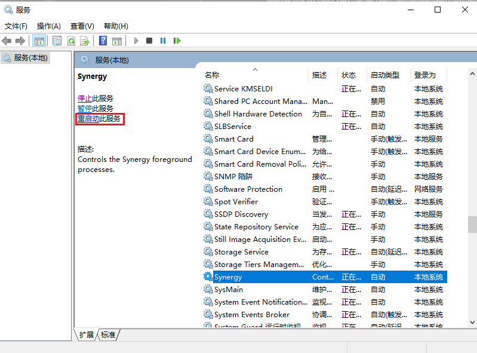

## Synergy使用说明

### 下载说明

1.官网地址

- [官网地址付费购买](https://symless.com/synergy)

2.免费地址

- [github免费下载](https://www.brahma.world/synergy-stable-builds/)

### 问题说明
* 【client问题】说明：failed to connect to server: Timed out  
  
* 解决：此种情况一般是因为client无法连接server服务的ip
    * 查看连接的server服务ip，看本机是否能ping通，此时一般是ping不通的；如果ping不同，直接到server服务器中查看ip地址，修改即可（server防火墙最好也关闭） 
      

* 【client问题】说明：server refused client with name "Gudao"  
  
* 解决：此种情况一般是因为server中的Config Server不存在client服务
  * Config Server中添加client的服务名称 
    

* 【server问题】说明：failed to init synwinhk.dll, another program may be using it  
  
* 解决：
  * 在windows的服务管理中重启synergy服务 
    
