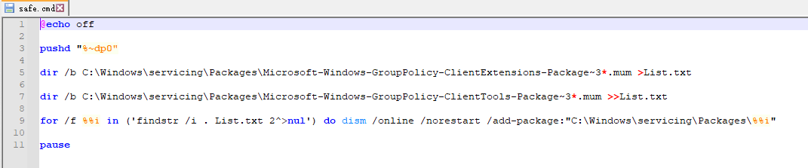
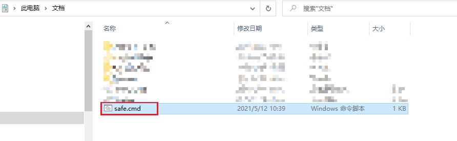
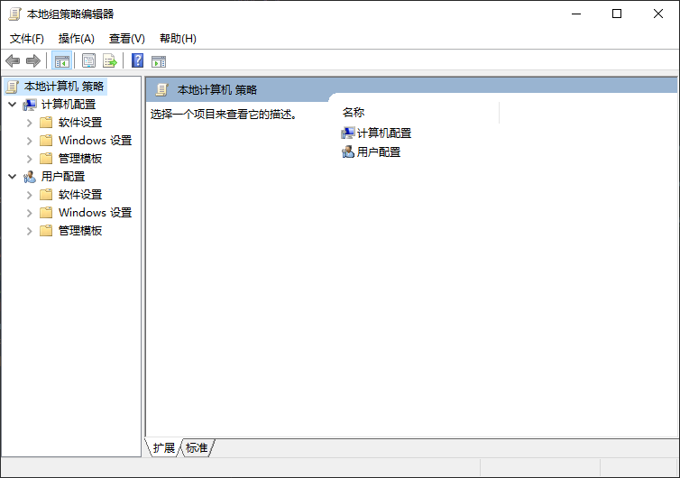

## Win10家庭版中启用组策略

### 引言
> 最入门级版本的Windows也可以离线升级高级版本。实际上入门版本的Windows，也包含最高版本的功能文件。我们只需要把它们找出来并启用就行了。

### 操作
#### 创建记事本，输入命令
* 打开记事本，创建文本文件，并输入以下内容（注意空格）【文件位置随意】
```text
@echo off

pushd "%~dp0"

dir /b C:\Windows\servicing\Packages\Microsoft-Windows-GroupPolicy-ClientExtensions-Package~3*.mum >List.txt

dir /b C:\Windows\servicing\Packages\Microsoft-Windows-GroupPolicy-ClientTools-Package~3*.mum >>List.txt

for /f %%i in ('findstr /i . List.txt 2^>nul') do dism /online /norestart /add-package:"C:\Windows\servicing\Packages\%%i"

pause
```
* 选择文件另存为，文件类型选择所有文件，名称随意，扩展名为`.cmd`把它保存下来
  
* 右键以管理员身份运行这个文件
  
* 弹出dos窗口，等待执行完成
  
* win+r 执行`gpedit.msc`查看一下组策略就有了。
  


