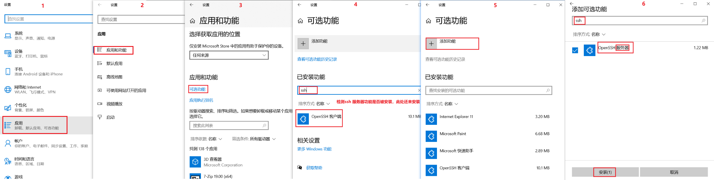
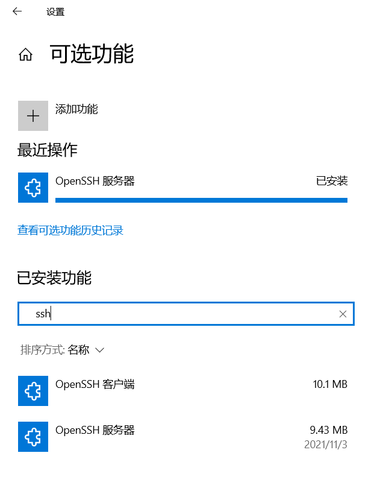
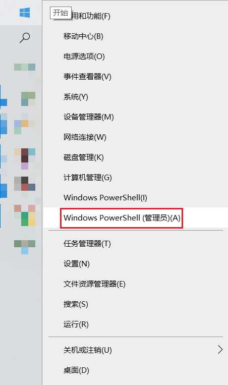
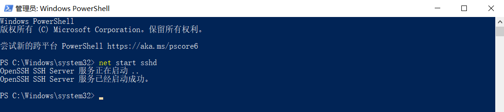
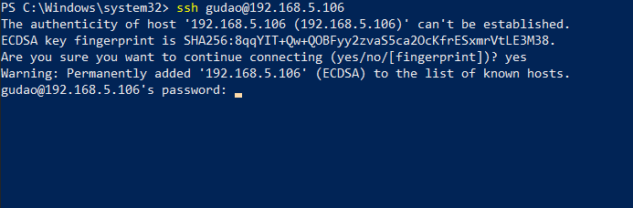
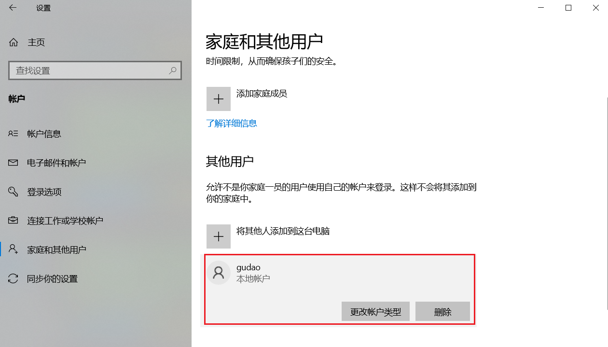

## Windows开启OpenSSH服务器（Windows会默认开启OpenSSH的客户端）（scp / ssh等）

### 环境
Windows 10

### 通过`win + s`打开设置窗口


### 安装OpenSSH服务器


### 安装完成


### 右击开始按钮，以管理员运行cmd


### cmd开启OpenSSH
```shell
# 开启命令
net start sshd

# 停止命令（此处不需要执行）

net stop sshd
```


### 远程连接测试
```shell
# 命令
ssh 用户名@用户ip

# 演示
ssh username@127.0.0.1
```


### 注意：如果不知道当前连接当前计算机的账号和密码，请看【【YC】windows本地用户创建.md】

