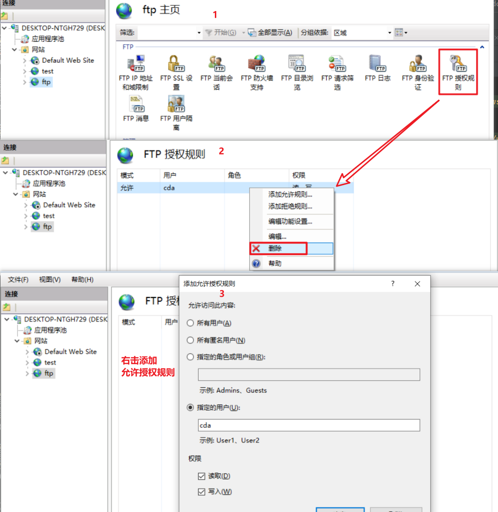

## FTP服务搭建

### 安装环境
* Windows10 专业版

### 关闭防火墙


### 开启ftp、iis功能


### 创建用户，给创建的ftp使用（可以不创建，直接允许匿名访问就可以不用帐号密码访问ftp文件夹）
#### 打开计算机管理

#### 创建用户（没有绑定组和角色，如果需要自己添加）


### 通过IIS创建ftp节点

#### 创建ftp站点

#### 创建步骤


### 连接
#### ftp命令连接
```shell
ftp://ip:端口
```

#### ftp登录

#### 进入文件


### 如果登录不成功，修改`ftp授权规则`，重新添加用户或者添加新用户


