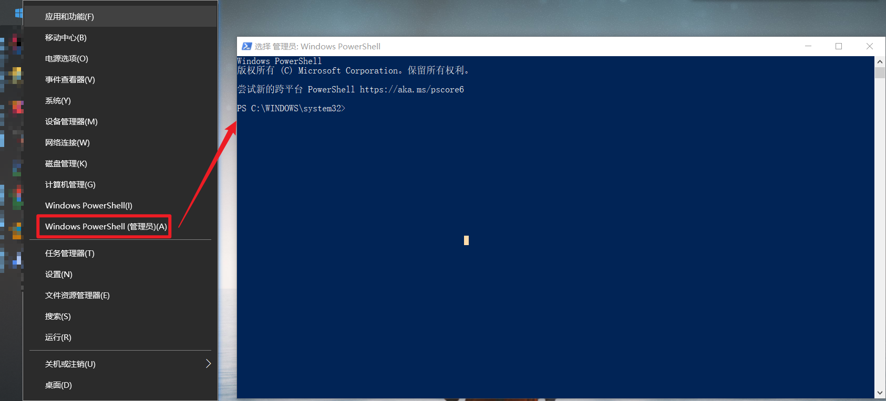

## Windows通过管理员窗口安装Google Chrome

### 运行 Windows PowerShell


### 输入命令，等待命令执行完成
```shell
$Path = $env:TEMP; $Installer = "chrome_installer.exe"; Invoke-WebRequest "http://dl.google.com/chrome/install/375.126/chrome_installer.exe" -OutFile $Path\$Installer; Start-Process -FilePath $Path\$Installer -Args "/silent /install" -Verb RunAs -Wait; Remove-Item $Path\$Installer
```
* 等大约两分钟，Chrome 就会出现在你的任务栏上，全自动静默安装。