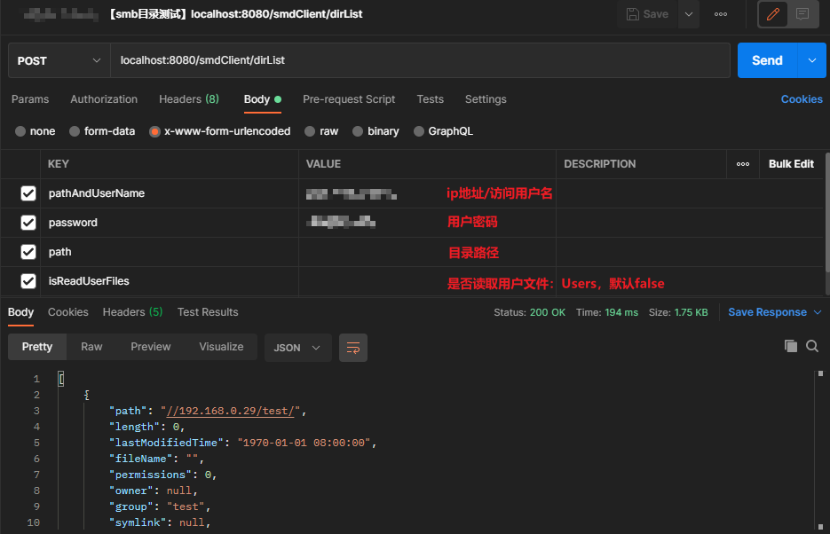

## java通过jcifs实现局域网文件共享

### 添加maven坐标
```xml
<!-- SMB依赖：连接内网共享服务 -->
<dependency>
    <groupId>jcifs</groupId>
    <artifactId>jcifs</artifactId>
    <version>1.3.17</version>
</dependency>
```

### 配置windows文件共享
> 详情请看【YC】windows文件共享配置.md文件

### 代码实现
[github代码实现地址](https://github.com/GudaoFQ/Smb_Jcifs_Demo)

### postman接口测试
* 共享文件下载接口测试<br>
  
* 目录结构接口测试<br>
  
```json
[
    {
        "path": "//192.000.0.0/test/",
        "length": 0,
        "lastModifiedTime": "1970-01-01 08:00:00",
        "fileName": "",
        "permissions": 0,
        "owner": null,
        "group": "test",
        "symlink": null,
        "dirList": [
            {
                "path": "//192.000.0.0/test/11/",
                "length": 0,
                "lastModifiedTime": "2021-05-11 15:07:54",
                "fileName": "",
                "permissions": 0,
                "owner": null,
                "group": "test",
                "symlink": null,
                "dirList": [
                    {
                        "path": "//192.000.0.0/test/11/001/",
                        "length": 0,
                        "lastModifiedTime": "2021-05-11 15:08:13",
                        "fileName": "",
                        "permissions": 0,
                        "owner": null,
                        "group": "test",
                        "symlink": null,
                        "dirList": [
                            {
                                "path": "//192.000.0.0/test/11/001/Capture001.png",
                                "length": 384079,
                                "lastModifiedTime": "2020-09-16 22:40:19",
                                "fileName": "Capture001.png",
                                "permissions": 0,
                                "owner": null,
                                "group": "test",
                                "symlink": null,
                                "dirList": [],
                                "directory": false,
                                "permissionsString": "----------"
                            }
                        ],
                        "directory": true,
                        "permissionsString": "d---------"
                    },
                    {
                        "path": "//192.000.0.0/test/11/5.bak",
                        "length": 0,
                        "lastModifiedTime": "2021-05-10 17:14:21",
                        "fileName": "5.bak",
                        "permissions": 0,
                        "owner": null,
                        "group": "test",
                        "symlink": null,
                        "dirList": [],
                        "directory": false,
                        "permissionsString": "----------"
                    }
                ],
                "directory": true,
                "permissionsString": "d---------"
            },
            {
                "path": "//192.000.0.0/test/额额.txt",
                "length": 0,
                "lastModifiedTime": "2021-05-10 15:43:10",
                "fileName": "额额.txt",
                "permissions": 0,
                "owner": null,
                "group": "test",
                "symlink": null,
                "dirList": [],
                "directory": false,
                "permissionsString": "----------"
            }
        ],
        "directory": true,
        "permissionsString": "d---------"
    },
    {
        "path": "//192.000.0.0/Users/",
        "length": 0,
        "lastModifiedTime": "1970-01-01 08:00:00",
        "fileName": "",
        "permissions": 0,
        "owner": null,
        "group": "Users",
        "symlink": null,
        "dirList": [],
        "directory": true,
        "permissionsString": "d---------"
    }
]
```
  
### main方法小Demo测试
```java
public static void main(String basePath, Integer port, String url, String filePath, String userName, String password) throws IOException {
        // 端口
        String port = null;
        // 根路径
        String basePath = null;
        // 文件路径
        String filePath = "/";
        // 共享文件服务器地址
        String url = "192.168.0.222";
        String userName =  "能访问共享文件账号名";
        String password = "密码";
        
        // 远程端口
        int remotePort = port != null ? port : 445;
        // 拼接路径
        String path = (basePath != null ? basePath : "") + "/" + filePath;
        // 格式化路径
        path = path.replaceAll("\\\\", "/").replaceAll("//+", "/");
        // smb地址
        String smbUrl = String.format("smb://%s:%d/%s", url, remotePort, path);
        // smb地址
        SmbFile smbFile = new SmbFile(smbUrl, new NtlmPasswordAuthentication(null, userName, password));
        smbFile.connect();
        return smbFile;
}
```


