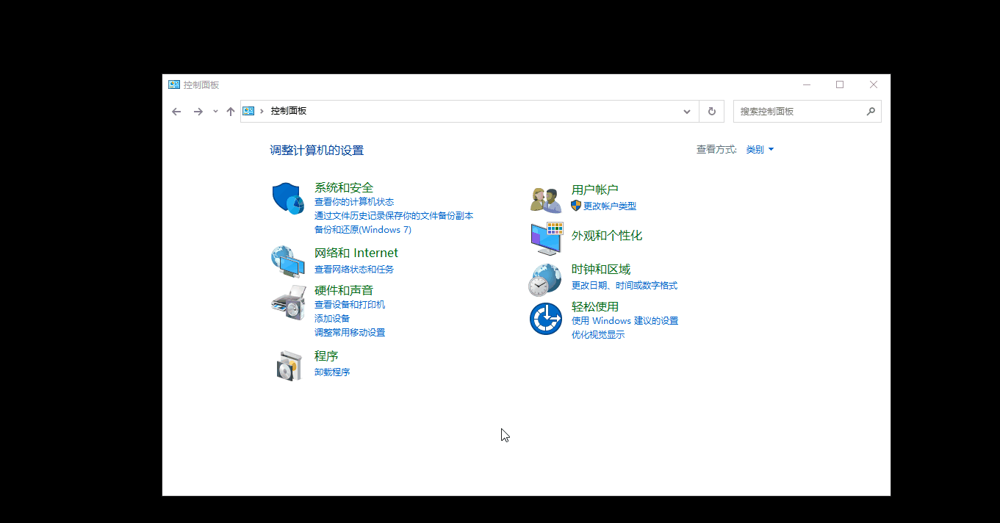
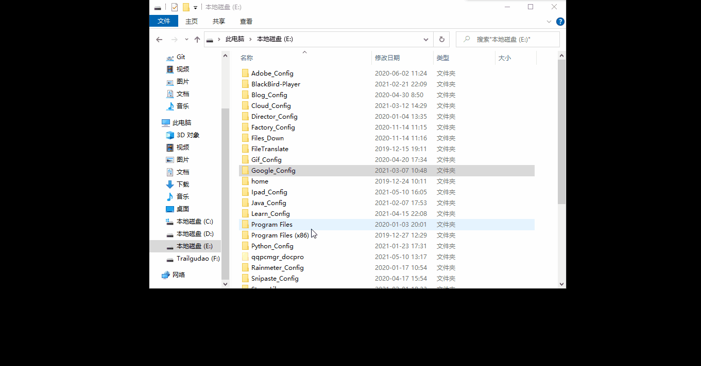
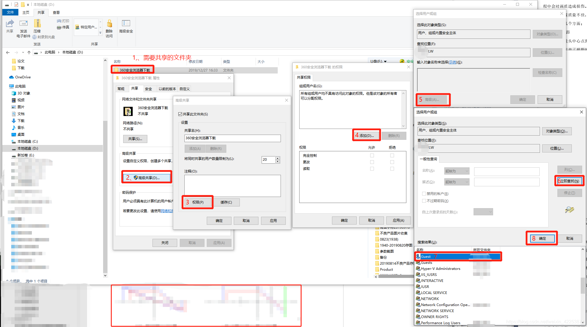
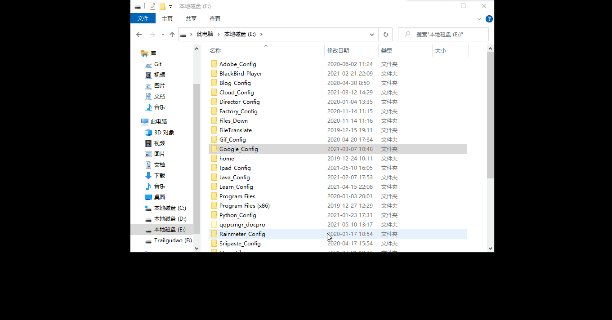
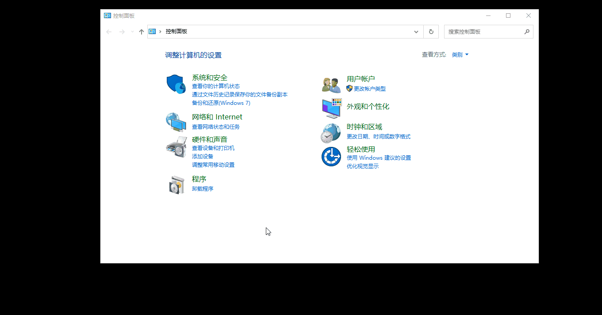
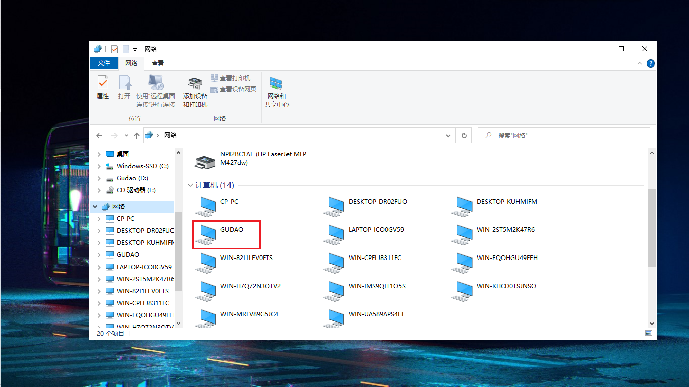
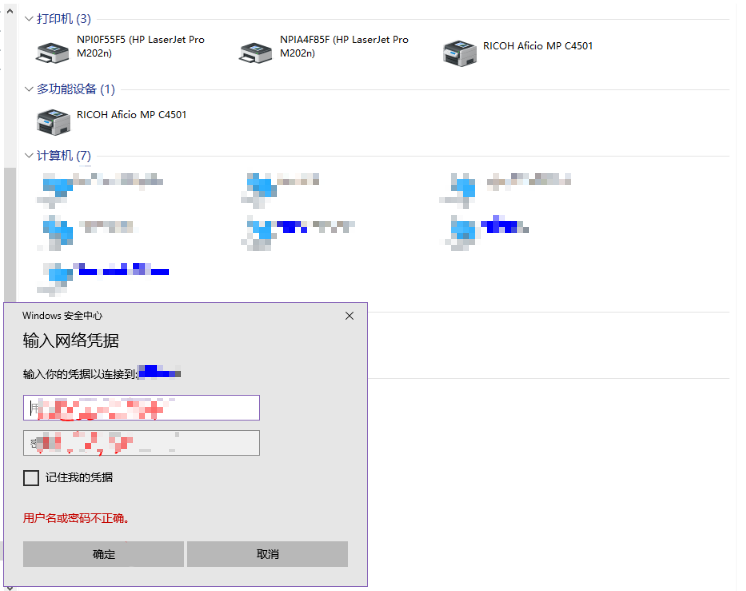

## Windows中配置共享文件夹【配置生效的前提：电脑连接的是网线，而不是wifi】

### 操作说明
#### 开启windows中的smb协议【开启后需要重启项目】

#### windows中创建新的用户，可以让别人通过这个新创建的用户访问共享文件【演示的`本地用户和组`是在windows10专业版本中才有的，其他版本即使`管理工具`配置了也会提示错误】

#### 选中需要共享的文件夹，配置属性，将文件夹共享【gif中的`test`和`Ipad_Cnfig`是以前共享的文件】

* 图文说明【文件中的权限配置就相当于**选择共享的用户**】 
    
  
#### 共享文件无权访问解决：添加文件共享用户【建议使用第二种方法】

* 【方法二】上面方法不能解决就使用该方法
  

#### 网络共享中心配置

* 在这样设置后，其他电脑应该就能看到这台共享电脑了。如果还不行的话，就需要进一步打开共享服务了。按Win+R后输入services.msc。在右侧找到“Function Discovery Resource Publication”并双击，点击“启动”

#### 启动Function Discovery Resource Publication

#### 其它电脑访问共享文件
* 找到服务

* 密码连接

#### 命令行删除windows凭据【当在`凭据管理`中找不到自己正在使用的windows凭据时用】
* 命令：`net use * /del` 
  

