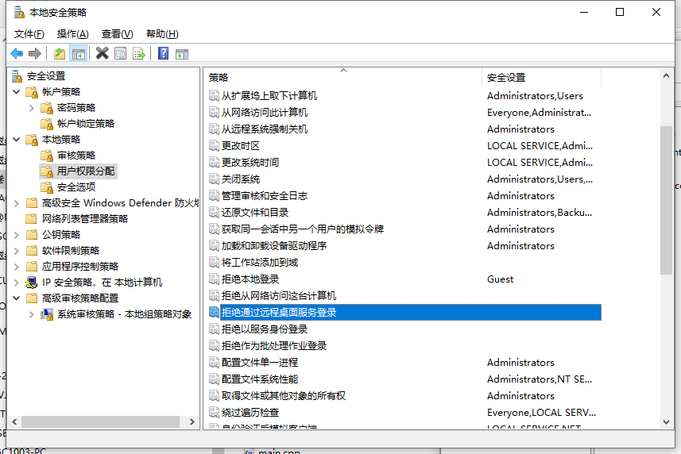
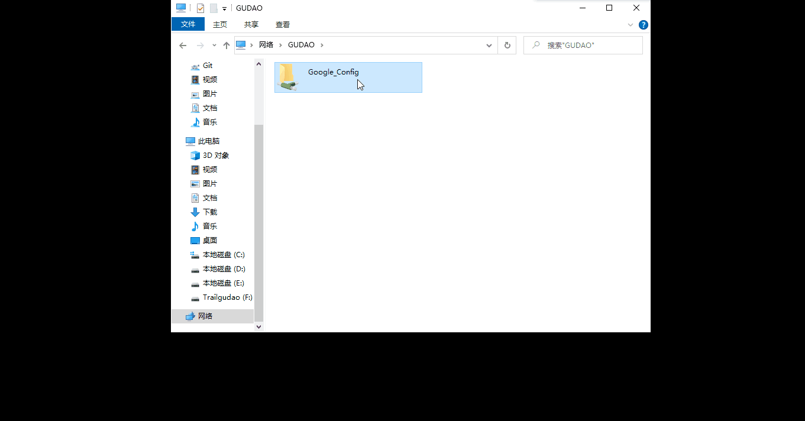

## Windows中配置共享文件夹【配置生效的前提：电脑连接的是网线，而不是wifi】

### 利用guest登录
> 系统默认禁止guest访问本地计算机 ，如果允许guest用户访问，需要进行下面设置：
* 开启guest账户 
  
* 允许Guest用户访问本机 ：打开组策略编辑器，依次选择“计算机配置→Windows设置→安全设置→本地策略→用户权利指派”，删除“拒绝从网络访问这台计算机”策略中的“GUEST”账号 
  
* 拒绝移除 
  
* 共享文件夹 
  
* 设置密码错误次数及重新计数时间 
  
  
### 自定义用户操作说明
#### 开启windows中的smb协议【开启后需要重启项目】

#### windows中创建新的用户，可以让别人通过这个新创建的用户访问共享文件【演示的`本地用户和组`是在windows10专业版本中才有的，其他版本即使`管理工具`配置了也会提示错误】

#### 选中需要共享的文件夹，配置属性，将文件夹共享【gif中的`test`和`Ipad_Cnfig`是以前共享的文件】

#### 共享文件无权访问解决：添加文件共享用户【建议使用第二种方法】

* 【方法二】上面方法不能解决就使用该方法 
  

#### 网络共享中心配置

* 在这样设置后，其他电脑应该就能看到这台共享电脑了。如果还不行的话，就需要进一步打开共享服务了。按Win+R后输入services.msc。在右侧找到“Function Discovery Resource Publication”并双击，点击“启动”

#### 启动Function Discovery Resource Publication

#### 其它电脑访问共享文件
* 找到服务 
  
* 密码连接 
  
* 访问共享文件命令`\\ip地址 
  

#### 命令行删除windows凭据【当在`凭据管理`中找不到自己正在使用的windows凭据时用】
* 命令：`net use * /del` 
  
* 凭据管理中移除windows凭据 
  

