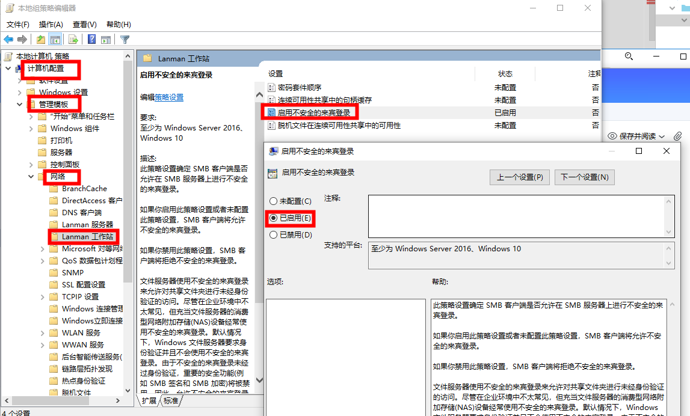

## Windows中设置**启用不安全的来宾登录**
> 问题：你不能访问此共享文件夹，因为你组织的安全策略阻止未经身份验证的来宾访问

### 问题
#### 通过运行命令访问共享文件服务器

#### 弹出异常信息

### 解决
#### 2020之前的版本
> 如果用户的系统是家庭版，没有**策略组**，请看【【YC】windows家庭版启用组策略.md】

* 首先按window+R键打开运行键入`gpedit.msc`启动本地组策略编辑器。
* 在组策略编辑器中找到 “计算机配置”–“管理模板”–“网络”–“Lanman工作站”
* “Lanman工作站”这个节点，在右侧内容区可以看到“启用不安全的来宾登录”这一条策略设置。状态是“未配置”。双击“启用不安全的来宾登录”这一条策略设置，将其状态修改为“已启用”并单击确定按钮。

#### 2020后版本
* 首先按window+R键打开运行键入gpedit.msc启动本地组策略编辑器。
* 进入地址计算机\HKEY_LOCAL_MACHINE\SYSTEM\CurrentControlSet\Services\LanmanWorkstation\Parameters 将AllowInsecureGuestAuth设置为1
* 进入计算机\HKEY_LOCAL_MACHINE\SOFTWARE\Policies\Microsoft\Windows\LanmanWorkstation，将AllowInsecureGuestAuth设置为1