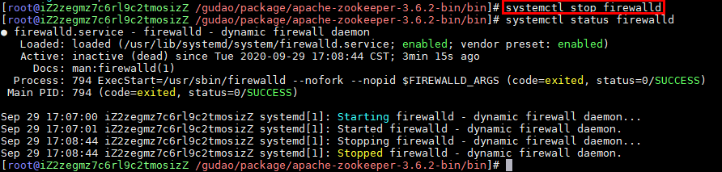
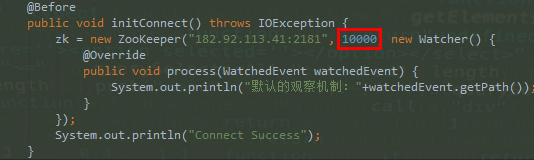

### java中查询zk服务器中的节点信息异常：org.apache.zookeeper.KeeperException$ConnectionLossException: KeeperErrorCode = ConnectionLoss for /gudao
```java
log4j:WARN No appenders could be found for logger (org.apache.zookeeper.ZooKeeper).
log4j:WARN Please initialize the log4j system properly.
log4j:WARN See http://logging.apache.org/log4j/1.2/faq.html#noconfig for more info.
Connect Success

org.apache.zookeeper.KeeperException$ConnectionLossException: KeeperErrorCode = ConnectionLoss for /gudao
	at org.apache.zookeeper.KeeperException.create(KeeperException.java:99)
	at org.apache.zookeeper.KeeperException.create(KeeperException.java:51)
	at org.apache.zookeeper.ZooKeeper.getChildren(ZooKeeper.java:1532)
	at org.apache.zookeeper.ZooKeeper.getChildren(ZooKeeper.java:1560)
	at zookeeper.TestZk.getChildNode(TestZk.java:42)
	at sun.reflect.NativeMethodAccessorImpl.invoke0(Native Method)
	at sun.reflect.NativeMethodAccessorImpl.invoke(NativeMethodAccessorImpl.java:62)
	at sun.reflect.DelegatingMethodAccessorImpl.invoke(DelegatingMethodAccessorImpl.java:43)
	at java.lang.reflect.Method.invoke(Method.java:498)
	at org.junit.runners.model.FrameworkMethod$1.runReflectiveCall(FrameworkMethod.java:47)
	at org.junit.internal.runners.model.ReflectiveCallable.run(ReflectiveCallable.java:12)
	at org.junit.runners.model.FrameworkMethod.invokeExplosively(FrameworkMethod.java:44)
	at org.junit.internal.runners.statements.InvokeMethod.evaluate(InvokeMethod.java:17)
	at org.junit.internal.runners.statements.RunBefores.evaluate(RunBefores.java:26)
	at org.junit.runners.ParentRunner.runLeaf(ParentRunner.java:271)
	at org.junit.runners.BlockJUnit4ClassRunner.runChild(BlockJUnit4ClassRunner.java:70)
	at org.junit.runners.BlockJUnit4ClassRunner.runChild(BlockJUnit4ClassRunner.java:50)
	at org.junit.runners.ParentRunner$3.run(ParentRunner.java:238)
	at org.junit.runners.ParentRunner$1.schedule(ParentRunner.java:63)
	at org.junit.runners.ParentRunner.runChildren(ParentRunner.java:236)
	at org.junit.runners.ParentRunner.access$000(ParentRunner.java:53)
	at org.junit.runners.ParentRunner$2.evaluate(ParentRunner.java:229)
	at org.junit.runners.ParentRunner.run(ParentRunner.java:309)
	at org.junit.runner.JUnitCore.run(JUnitCore.java:160)
	at com.intellij.junit4.JUnit4IdeaTestRunner.startRunnerWithArgs(JUnit4IdeaTestRunner.java:68)
	at com.intellij.rt.execution.junit.IdeaTestRunner$Repeater.startRunnerWithArgs(IdeaTestRunner.java:47)
	at com.intellij.rt.execution.junit.JUnitStarter.prepareStreamsAndStart(JUnitStarter.java:242)
	at com.intellij.rt.execution.junit.JUnitStarter.main(JUnitStarter.java:70)
```

#### 代码：
```java
public class TestZk {

    ZooKeeper zk;

    @Before
    public void initConnect() throws IOException {
        zk = new ZooKeeper("182.92.113.41:2181", 10000, new Watcher() {
            @Override
            public void process(WatchedEvent watchedEvent) {
                System.out.println("默认的观察机制："+watchedEvent.getPath());
            }
        });
        System.out.println("Connect Success");
    }

    @Test
    public void getChildNode() throws KeeperException, InterruptedException {
        List<String> children = zk.getChildren("/gudao", false);
        children.forEach(event->{
            System.out.println(event);
        });
    }
}

```

#### 说明：
> @Before中的代码能执行完成，但是@Test中的代码去执行报出上面异常；博客中有人说是设置连接时间过短，有的说是服务器的防火墙未关闭；我都试了下，都没有解决这个问题【可能因为我用的是阿里云的服务器】

#### 解决方法：
   - 配置阿里云的安全组，将2181这个端口放开<br>
   <br>
   - 将服务器中的防火墙关闭<br>
   <br>
   - 增加连接时间<br>
   <br>
   
#### 补充：

```shell
#启动防火墙
systemctl start firewalld 

#禁用防火墙
systemctl stop firewalld

#设置开机启动
systemctl enable firewalld

#停止并禁用开机启动
sytemctl disable firewalld

#重启防火墙
firewall-cmd --reload
```