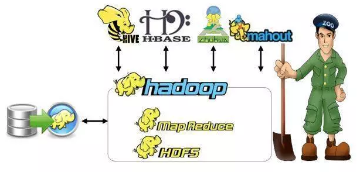
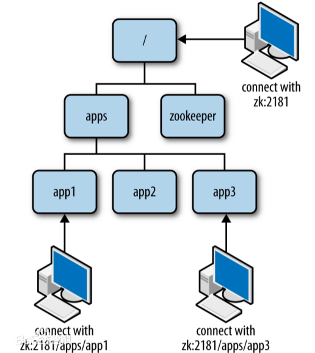

## Zookeeper概要、背景及作用

### zookeeper产生背景：

项目从单体到分布式转变之后，将会产生多个节点之间协同的问题。如：

1. 每天的定时任务由谁哪个节点来执行？
2. RPC调用时的服务发现?
3. 如何保证并发请求的幂等
4. ....

这些问题可以统一归纳为多节点协调问题，如果靠节点自身进行协调这是非常不可靠的，性能上也不可取。必须由一个独立的**服务做协调工作**，它必须可靠，而且保证性能。

### zookeeper概要：

ZooKeeper是用于分布式应用程序的协调服务。它公开了一组简单的API，分布式应用程序可以基于这些API用于同步，节点状态、配置等信息、服务注册等信息。其由JAVA编写，支持JAVA 和C两种语言的客户端。

### znode 节点：

zookeeper 中数据基本单元叫节点，节点之下可包含子节点，最后以树级方式程现。每个节点拥有唯一的路径path。客户端基于PATH上传节点数据，zookeeper 收到后会实时通知对该路径进行监听的客户端。

