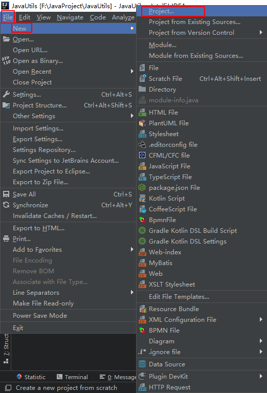
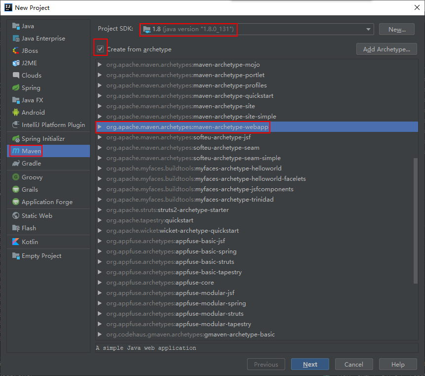
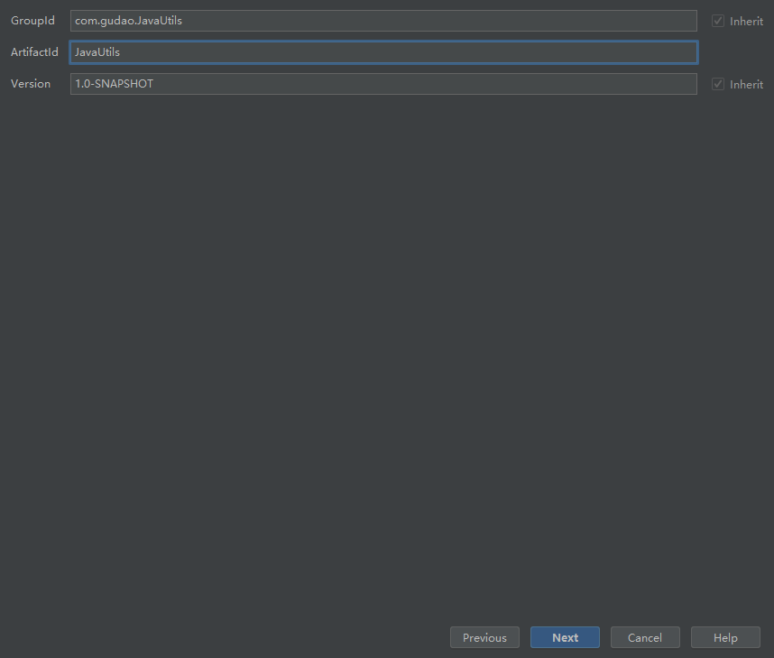
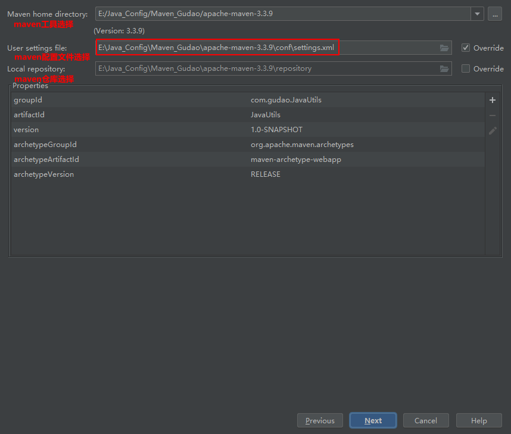
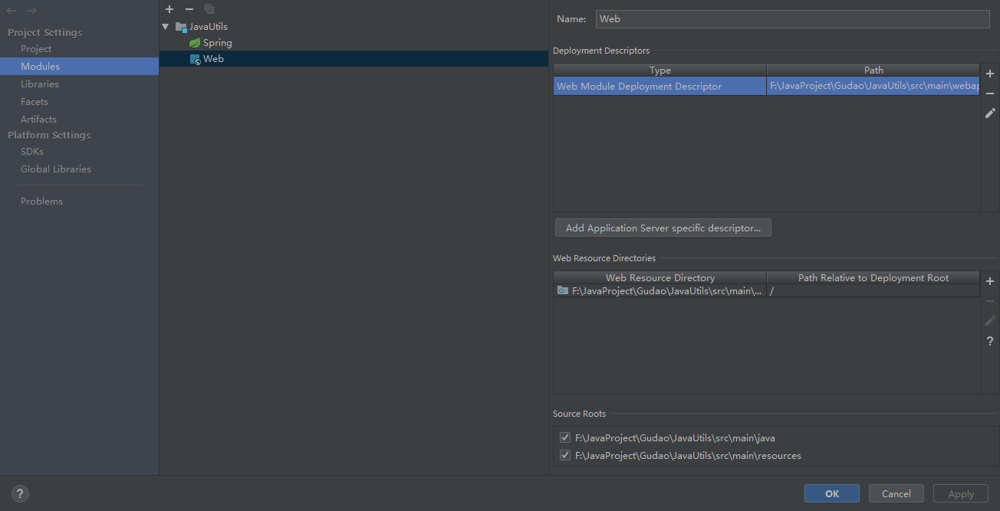
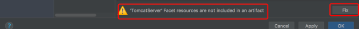
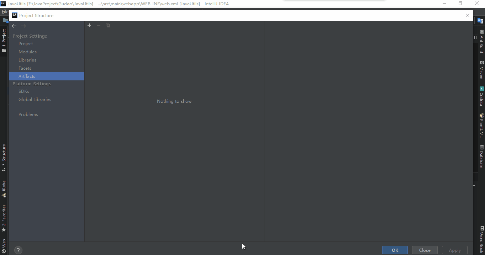
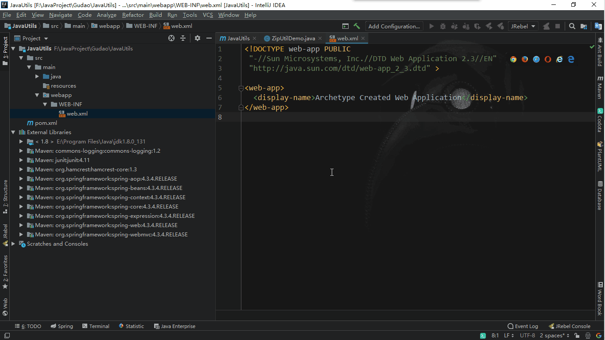

## 基于IDEA搭建SpringMVC

#### 创建Maven项目
> 选择 File -> New -> Project



#### 项目选择
> 左边栏中选择 Maven，选择 Create From archetype，然后选中 org.apache.maven.archetypes:maven-archetype-webapp，然后点击下一步



#### 填写信息
> 然后填写 GroupId 和 ArtifactId。GroupId 一般分为多个段，这里我只说两段，第一段为域，第二段为公司名称。域又分为 org, com, cn 等等许多，其中 org 为非营利组织，com 为商业组织。比如我创建一个项目，我一般会将 GroupId 设置 为 com.gudao，com 表示域为公司，gudao 是我个人姓名缩写，artifactId 设置为 JavaUtils，表示你这个项目的名称是 JavaUtils



#### 配置当前项目的maven


#### 项目中添加 Web 工程【如果idea没有帮忙创建】
> 现在我们只有 Spring 的框架，但 Spring MVC 必需的 Web 工程框架还没有搭建，所以需要向项目中添加 Web 工程。
> 点击菜单 File -> Project Structure，选中左侧栏 Project Settings 的 Facets，在顶部的 “+” 中选择 Web，并在弹出的 Choose Modules 窗口中选择当前 Module，确认。此外，将 Web Resource Directory 的 “…/web” 改为 “…/webapp”，笔者这样的操作是为了与 Tomcat 的 webapp 路径名称对应。



##### 在项目中的webapp没有被创建出现的问题


##### Project Structure -> Facets 
> 此外在右下角有一个 Create Artifact 的按钮，点击后进入 Artifacts 标签栏中，将右边区域的所有内容添加到左区域，然后点击 Ok 完成 Web 工程的添加。



#### Tomcat配置


#### web.xml文件配置
```xml
<?xml version="1.0" encoding="UTF-8"?>
<web-app xmlns="http://xmlns.jcp.org/xml/ns/javaee"
         xmlns:xsi="http://www.w3.org/2001/XMLSchema-instance"
         xsi:schemaLocation="http://xmlns.jcp.org/xml/ns/javaee http://xmlns.jcp.org/xml/ns/javaee/web-app_4_0.xsd"
         version="4.0">

    <listener>
        <listener-class>org.springframework.web.context.ContextLoaderListener</listener-class>
    </listener>

    <context-param>
        <param-name>contextConfigLocation</param-name>
        <param-value>classpath*:application-context.xml</param-value>
    </context-param>

    <servlet>
        <servlet-name>dispatcherServlet</servlet-name>
        <servlet-class>org.springframework.web.servlet.DispatcherServlet</servlet-class>
        <!-- 配置Servlet的初始化参数，读取springmvc的配置文件，创建spring容器 -->
        <init-param>
            <param-name>contextConfigLocation</param-name>
            <param-value>classpath*:application-context-mvc.xml</param-value>
        </init-param>
        <!-- 配置servlet启动时加载对象 -->
        <load-on-startup>1</load-on-startup>
    </servlet>
    <servlet-mapping>
        <servlet-name>dispatcherServlet</servlet-name>
        <url-pattern>/</url-pattern>
    </servlet-mapping>
    
    <filter>
        <filter-name>characterEncodingFilter</filter-name>
        <filter-class>org.springframework.web.filter.CharacterEncodingFilter</filter-class>
        <!-- 指定字符集 -->
        <init-param>
            <param-name>encoding</param-name>
            <param-value>UTF-8</param-value>
        </init-param>
    </filter>
    <filter-mapping>
        <filter-name>characterEncodingFilter</filter-name>
        <!-- 拦截路径 -->
        <url-pattern>/*</url-pattern>
    </filter-mapping>
</web-app>
```

#### spring配置文件:application-context.xml
```xml
<?xml version="1.0" encoding="UTF-8"?>
<beans xmlns="http://www.springframework.org/schema/beans"
       xmlns:xsi="http://www.w3.org/2001/XMLSchema-instance"
       xsi:schemaLocation="http://www.springframework.org/schema/beans
        http://www.springframework.org/schema/beans/spring-beans.xsd">

    <!--把对象的创建交给spring来管理-->
    <!--<bean id="accountService" class="com.itheima.service.impl.AccountServiceImpl"></bean>

    <bean id="accountDao" class="com.itheima.dao.impl.AccountDaoImpl"></bean>-->
</beans>
```

#### mvc配置文件:application-context-mvc.xml
```xml
<?xml version="1.0" encoding="UTF-8"?>
<beans xmlns="http://www.springframework.org/schema/beans"
       xmlns:mvc="http://www.springframework.org/schema/mvc"
       xmlns:context="http://www.springframework.org/schema/context"
       xmlns:xsi="http://www.w3.org/2001/XMLSchema-instance"
       xsi:schemaLocation="
        http://www.springframework.org/schema/beans
        http://www.springframework.org/schema/beans/spring-beans.xsd
        http://www.springframework.org/schema/mvc
        http://www.springframework.org/schema/mvc/spring-mvc.xsd
        http://www.springframework.org/schema/context
        http://www.springframework.org/schema/context/spring-context.xsd">

    <!-- 配置spring创建容器时要扫描的包 -->
    <context:component-scan base-package="com.gudao.zip_utils"></context:component-scan>

    <!-- 配置视图解析器 -->
    <bean id="viewResolver" class="org.springframework.web.servlet.view.InternalResourceViewResolver">
        <property name="prefix" value="/WEB-INF/pages/"></property>
        <property name="suffix" value=".jsp"></property>
    </bean>
    <!-- 配置spring开启注解mvc的支持-->
    <mvc:annotation-driven></mvc:annotation-driven>
</beans>
```